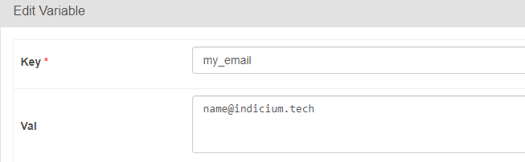
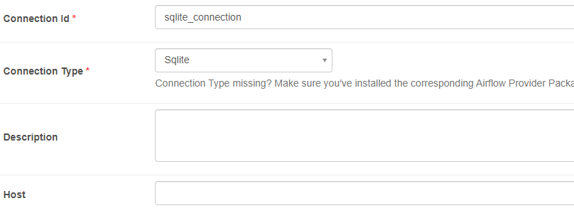

# Indicium Airflow

## O Problema

Utilizando a base de dados `/data/Northwhind_small.sqlite`, desejamos saber a quantidade de vendas para o destino do Rio da janeiro. Para isso, deve ser seguido os seguintes requerimentos de execução:


- 1 - Crie uma task que lê os dados da tabela 'Order' do banco de dados disponível em `data/Northwhind_small.sqlite`. O formato do banco de dados é o Sqlite3. Essa task deve escrever um arquivo chamado "output_orders.csv".

- 2 - Crie uma task que lê os dados da tabela "OrderDetail" do mesmo banco de dados e faz um JOIN com o arquivo "output_orders.csv" que você exportou na tarefa anterior. Essa task deve calcular qual a soma da quantidade vendida (Quantity) com destino (ShipCity) para o Rio de Janeiro. Você deve exportar essa contagem em arquivo "count.txt" que contenha somente esse valor em formato texto.

- 3 - Adicione uma variável no Airflow com a key "my_email" e no campo "value" adicione seu email @indicium.tech. Exemplo:



- 4 - Crie uma ordenação de execução das Tasks que deve terminar com a task export_final_output conforme o exemplo abaixo:

    `task1 >> task2 >> export_final_output`

## Setup

Para criar um projeto python é recomendável trabalhar com ambientes virtuais, para isso você iniciar um terminal e rodar os seguintes comandos:

- Baixe o repositório em sua máquina, ou clone no terminal com o comando:
```
git@github.com:Lineker98/Desafio-DE.git
cd Desafio-DE
```

- Criação do ambiente virtual para instalação das dependências:
```
pip install virtualenv
```

- Com o venv instalado, e dentro do diretório do projeto, execute:
```
python3 -m venv .venv
```

- Para ativação do ambiente, digite no terminal
    - Linux:
    ```console
    source .venv/bin/activate
    ```

    - Windows:
    ```
    .venv\Scripts\activate
    ```

- Já com o ambiente virtual instalado, digite: `bash instal.sh`.


Se as coisas deram certo, no terminal vai aparecer a seguinte mensagem:

```
standalone | 
standalone | Airflow is ready
standalone | Login with username: admin  password: sWFbFYrnYFAfYgY3
standalone | Airflow Standalone is for development purposes only. Do not use this in production!
standalone |
```

airflow roda na porta 8080, então podemos acessar em 
http://localhost:8080

tomar um tempo aqui para ver a interface, as dags, tome um tempo para explorar a interface.

## Limpando os Dags de Exemplo

Para tirar os dags de exemplo e começar um dag nosso, podemos apagar os arquivos
airflow-data/data e airflow-data/admin-password.txt, e editar o arquivo airflow.cfg trocando:
```
load_examples = True
```
para
```
load_examples = False
```

Feito isso, primeiro precisamos configurar o ambiente para dizer onde vão ficar os arquivos de config do airflow, fazemos isso configurando a seguinte variavel de ambiente:

```
export AIRFLOW_HOME=./airflow-data
```

Dessa forma configuramos o airflow para colocar suas configurações dentro da pasta desse tutorial na pasta /airflow-data

Na sequência rodamos o comando para resetar o db do airflow e fazer start do airflow local:

```
airflow db reset
airflow standalone
```

Por fim, é necessário configurar a conexão para o seu banco sqlite, para isso, podemos utilizar a interface do airflow da seguinte forma: Na aba "Admin > Concections", clique a adicionar uma nova conexão:



Para realizar a conexão com a base dados sqlite, basta informar o id, o tipo e o host. Para o id, basta manter o mesmo ocmo exibido na imagem acima, caso houver alterações, é necessário informar o novo id no código. O tipo definimos com Sqlite e o host é o caminho para o arquivo que deseja trabalhar sobre.

Pronto! Você já está apto para executar e testar a dag criada!